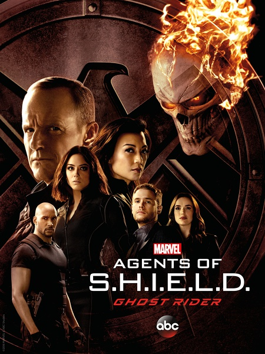

看了这么多季的神盾局，第四季的脑洞特别大。  
是不是编剧也看了  **「西部世界」**   回来编的？
E15的最后大家都进入了framework，framework理沃特居然活过来了？Emma挂了，Mei在九头蛇工作。。。。   
这个关于美剧的<a href="http://mp.weixin.qq.com/s/20Dh7_evx0ZtEhifjB2RuQ" target="_blank">微信号</a>分析得也相当深入     
话说回来恶灵骑士是去了哪了？？ - -

Marvel的电视剧也看了很多， **「夜魔侠」**   **「Jessica Jones」**   **「Luke Cage」**   **「卡特特工」**  ，接下来还有 **「铁拳」**    
然后夜魔侠Jessica卢克铁拳就要开始联动了。

DC方面的话在看 **「绿箭侠」**  和 **「超女」**  ，话说绿箭侠越来越鬼扯了，那五年荒岛居然还没说完，Olivier究竟你都遇到了什么。。。。。。。   
超女真的纯粹是看超女妹纸。。简直是套时装剧，妹纸每次都穿得那么好看。 绿箭侠超女闪电侠还会有乱七八糟的联动，但剧情真是好烂。。

其它剧的话看完的那一堆就不说了，刚看过 **「超感八人组」**  剧情高燃但是节奏慢啊啊啊，还有 **「时间永恒」**  ，其实制作精良，不过故事也是鬼扯了点而且也很冷门。 

现在在看 **「国土安全」**  第六季好好看啊，不过Quinn继续被虐。。编剧是和他有仇？   

接下来 **「纸牌屋」**  马上来了，还有想看看没有Jack Bauer的 **「24小时」**  。

